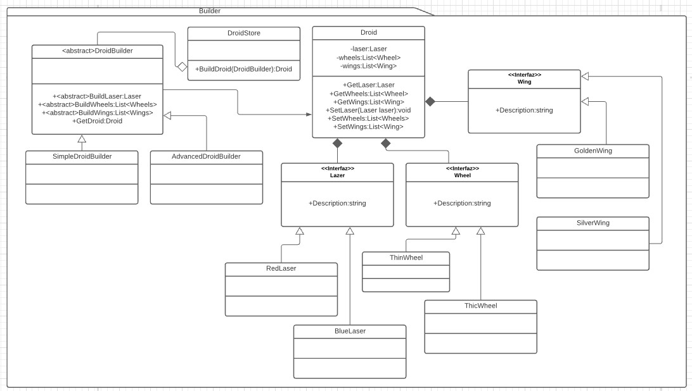

# Builder
Es un patrón creacional. [Link descripción](https://www.tutorialspoint.com/design_pattern/builder_pattern.htm)

El patrón builder se encarga de instanciar nuevos objetos complejos compuestos de varias dependencias que debén ser creadas para obtener un objeto completo.

## Diagrama de clases

## SOLID

* Single responsibility
 
La única responsabilidad del builder es construir objetos completos, por ese lado esta cubierta la responabilidad, pero el builder debe ser modificado si cambia la implementación de algunas de las dependencias del objeto complejo. Lo que rompería con el principio.

* Open/Closed principle

Si necesitamos crear nuevos objetos con crear un nuevo builder alcanza, por lo que este punto estaría Ok.
 
* Liskov substitution principle
 
Cualquie builder puede sustituir al builder abstracto, ademas si siempre esperamos una interfaz los objetos creados por los diferentes builders del mismo tipo de objetos también serán sustituibles.

* Interface segregation

Poner todos los métodos de creación de dependencia en la clase builder abstracta desafía este principio pero con un poco de cuidado pueden desarrollarse builders que segreguen la interfaz correctamente (utilizando una interfaz builder en lugar de clase abstracta con template method como en este ejemplo). 

* Dependency inversion

Tanto los builders como el objeto a crear son referenciados siempre por sus superclases por lo que la inversión de dependencia se cumple.
